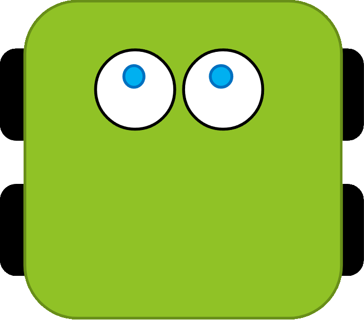
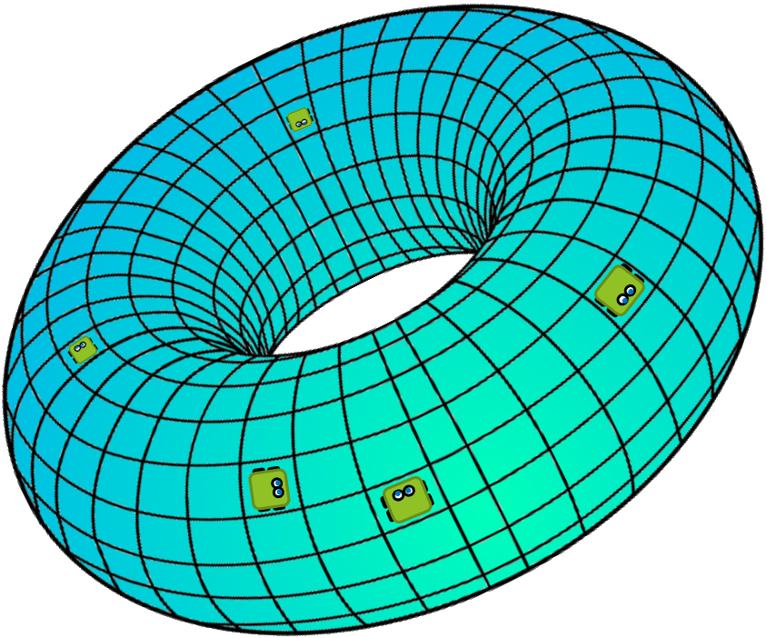

### TorLand

TorLand — проект, представляющий собой симуляцию эволюции, где боты, модели примитивных микроорганизмов, развиваются и адаптируются к условиям виртуального мира.

<br>
Бот - модель примитивного организма. Он выполняет замкнутую последовательность инструкций, которая является его геномом. 

<br>
Мир - среда обитания ботов, во многом определяющая пути их эволюции.

Проект состоит из двух основных компонентов:
- botc — компилятор языка [botlang](./botc/bot.md). Он позволяет компилировать и декомпилировать геном ботов.
- torland — мир ботов. Он позволяет выполнять симуляцию их эволюции.

Оба компонента доступны онлайн ([botc](https://wdrop.ru/compiler/) и [torland](https://wdrop.ru/)), а также существует возможность собрать офлайн версию:

```
git clone https://github.com/Slava2001/TorLand.git
cd TorLand
cargo build --release

.\target\release\botc 

.\target\release\torlandbin
```

### Участие:
Мы приветствуем вклад сообщества! Если у вас есть идеи для улучшения, создавайте issue или отправляйте pull request.